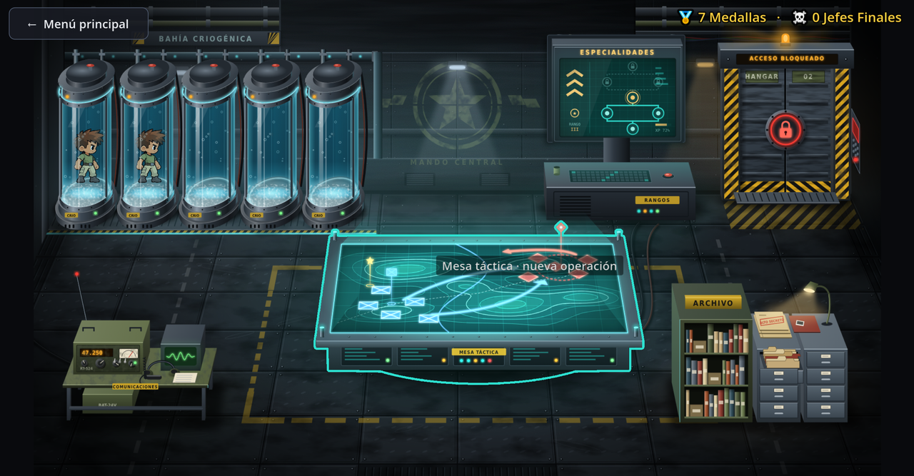
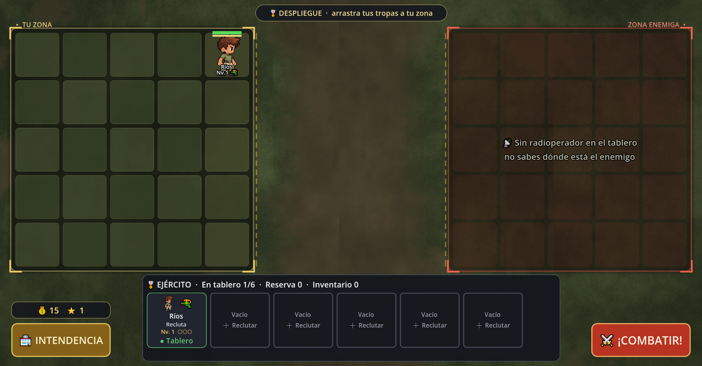
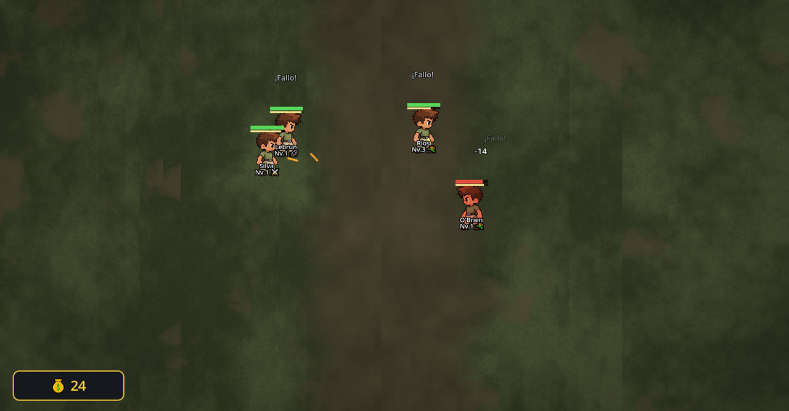
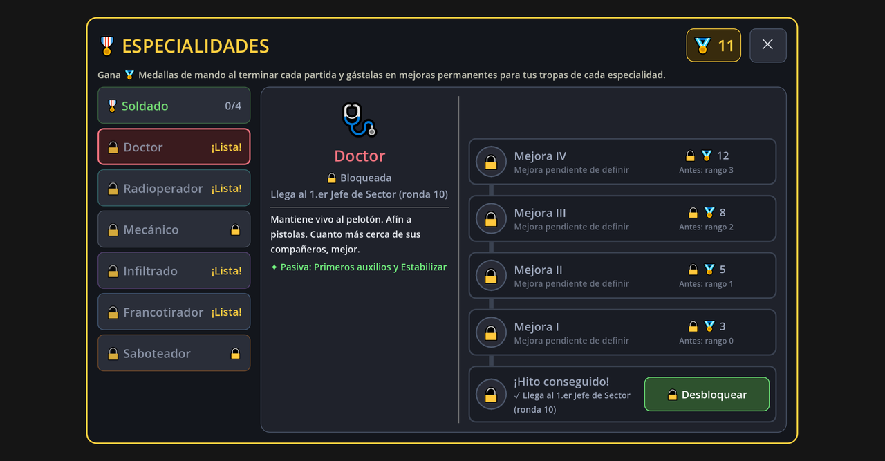

# 🎖️ Tropas en miniatura

**Auto-battler roguelite en 2D** hecho con **Godot 4.7**. Recluta soldados únicos, despliégalos en el tablero, equípalos y mejóralos ronda a ronda… y aguanta hasta que aparezca el **Jefe Final**. Entre partida y partida, desde tu **Centro de mando**, guardas a tus mejores veteranos y haces crecer a tus especialistas.



> Proyecto en desarrollo activo. Interfaz y textos en español. Pensado para PC; el Centro de mando ya está preparado también para móvil en horizontal.

---

## Índice
- [Cómo se juega](#cómo-se-juega)
- [Características](#características)
- [Especialidades](#especialidades)
- [Progresión entre partidas](#progresión-entre-partidas)
- [Capturas](#capturas)
- [Cómo abrirlo y ejecutarlo](#cómo-abrirlo-y-ejecutarlo)
- [Estructura del proyecto](#estructura-del-proyecto)
- [Tests](#tests)
- [Partidas guardadas](#partidas-guardadas)
- [Estado y próximos pasos](#estado-y-próximos-pasos)
- [Créditos y licencia](#créditos-y-licencia)

---

## Cómo se juega

1. **Menú principal** → *Jugar* te lleva al **Centro de mando**.
2. En la **Mesa táctica** empiezas una operación (run). Eliges tu primer recluta entre 3.
3. Cada ronda tiene dos fases:
   - **Planificación**: arrastras tus tropas a tu zona del tablero (5×5), compras en la **Intendencia** (reclutas, objetos y armas con 💰 monedas) y subes de nivel a tus soldados con ⭐ Puntos de Mando.
   - **Combate**: las tropas luchan solas. Cada arma tiene su alcance, precisión y distancia de combate preferida.
4. Las rondas son **infinitas**: cada 10 rondas hay un **Jefe de Sector**, y a partir de la ronda 11 una ruleta puede hacer aparecer al **Jefe Final** (+0,5 % por ronda). Vencerlo gana la partida.
5. Al terminar recibes **🏅 Medallas de mando** para mejorar tus especialidades, y si ganaste puedes **criogenizar a uno de tus soldados** como veterano.

## Características

- **Tropas únicas**: cada recluta tiene nombre, vida y daño propios (±10 %), un arma y, a veces, un objeto o una especialidad.
- **Combate táctico automático**: IA por carriles, separación entre compañeros, distancia de combate según el arma, precisión que cae con la distancia, disparo en marcha solo con armas ligeras, explosiones con caída de daño, fuego amigo con balas desviadas y críticos/impactos letales.
- **9 armas**: cuchillo, pistola, escopeta, subfusil, fusil de asalto, ametralladora, rifle de francotirador, lanzallamas y bazuca. Se mejoran con ⭐.
- **Objetos** (3 huecos por tropa: munición, armadura, utilidad) y **habilidades pasivas** que se eligen al subir de nivel.
- **Economía de run**: monedas por baja y por victoria con interés; Puntos de Mando por victoria; presupuesto de poder enemigo que crece cada ronda.
- **Códice** con todas las habilidades, objetos, armas y especialidades.
- **Centro de mando** en vista ¾ con objetos interactivos que brillan al pasar el ratón: mesa táctica, tubos criogénicos con tus veteranos, archivo (Códice), terminal de especialidades, hangar del Modo Infinito y radio (Configuración).
- **Configuración** para PC: ventana / pantalla completa / sin bordes, resolución, VSync y límite de FPS.

## Especialidades

Las tropas eligen especialidad al llegar a **Nv. 5** (algunos reclutas de la Intendencia ya vienen especializados). En una partida guardada nueva **solo está disponible el Soldado**; el resto se consigue alcanzando hitos y **se desbloquea a mano en el Centro de mando al terminar la partida**.

| Especialidad | Rol | Se consigue al… |
|---|---|---|
| 🎖️ **Soldado** | Fuego de supresión: los impactos reducen la precisión y la velocidad del blanco | Desde el principio |
| 🩺 **Doctor** | Cura al aliado más herido y salva una vez a quien iba a caer | Llegar al 1.er Jefe de Sector |
| 📡 **Radioperador** | Revela el mapa de calor enemigo, marca objetivos y pide artillería | Llegar al 2.º Jefe de Sector |
| 🎯 **Francotirador** | Apunta al enemigo más peligroso; crítico extra contra suprimidos o marcados | Llegar al 3.er Jefe de Sector |
| 🗡️ **Infiltrado** | Aparece tras las líneas enemigas *(mecánica en desarrollo)* | Vencer al Jefe Final |
| 🔧 **Mecánico** | Especialista en vehículos *(en desarrollo)* | Llegar al 4.º Jefe de Sector |
| 🧨 **Saboteador** | Sabotea vehículos, armas, trampas y minas enemigas *(en desarrollo)* | Completar el Modo Infinito |

Cada especialidad es afín a una familia de armas (+15 % de daño y +10 de precisión con ellas).

## Progresión entre partidas

- **🏅 Medallas de mando**: 1 por cada 5 rondas ganadas, 2 por cada Jefe de Sector y 5 por el Jefe Final.
- **Árbol de especialidades**: cada especialidad tiene un árbol en línea recta (rango 0 = la especialidad, rangos 1–4 = mejoras) que se compra con medallas y afecta solo a tus tropas. *Las mejoras concretas están pendientes de definir.*
- **Veteranos**: al vencer al Jefe Final eliges a uno de tus soldados (de todo tu ejército) y queda criogenizado en el Centro de mando con todo su equipo. Hay **5 tubos**; con los 5 llenos se abre el hangar del **Modo Infinito** *(próximamente)*. Un veterano se puede eliminar manteniendo pulsado el botón y confirmando.

## Capturas

| Planificación | Combate |
|---|---|
|  |  |

| Árbol de especialidades |
|---|
|  |

## Cómo abrirlo y ejecutarlo

**Requisitos:** [Godot 4.7](https://godotengine.org/download) (versión estándar, no hace falta .NET).

1. Clona el repositorio:
   ```bash
   git clone https://github.com/adry2342/tropas-en-miniatura.git
   ```
2. Abre Godot → **Importar** → selecciona `project.godot`.
3. Pulsa **F5** (o ▶) para jugar. La escena principal es `Scenes/UI/main_menu.tscn`.

**Exportar a Windows:** en Godot, *Proyecto → Exportar…* (hay presets de Windows y Android en `export_presets.cfg`; ajusta la ruta de salida). Necesitas instalar las plantillas de exportación de Godot 4.7.

## Estructura del proyecto

```
Assets/            Sprites, arte del Centro de mando (Assets/CommandCenter) y shaders
Resources/         Contenido en .tres: armas, objetos, habilidades y especialidades
Scenes/            Escenas: batalla, mapa, tropas y UI (menú, Centro de mando, paneles…)
Scripts/
  Autoloads/       GameStateManager (estado de la run), ProfileManager (perfil persistente),
                   SettingsManager (configuración) y EventBus (señales globales)
  Battle/          Batalla, cuadrícula de despliegue, balas, minas, efectos visuales
  Systems/         Reglas: estadísticas (TroopStats), economía, subida de nivel, tienda,
                   fábrica de unidades, efectos de habilidades, progresión de especialidades
  Troops/          Comportamiento e IA de las tropas
  UI/              Interfaz: Centro de mando, ficha de tropa, Códice, árbol, tienda…
docs/img/          Capturas para este README
_dev/              Tests automáticos, simuladores y documentos de diseño (no forman parte del juego)
addons/godot_ai/   Plugin del editor usado durante el desarrollo (MIT)
```

Todo el contenido (armas, objetos, habilidades, especialidades) se registra en `Scripts/Systems/game_content.gd`. Las estadísticas finales de una tropa salen siempre de `TroopStats.compute(card)`.

## Tests

En `_dev/` hay escenas de test que se ejecutan desde el editor (abre la escena y pulsa **F6**). Cada una imprime `TEST PASS` / `TEST FAIL` y termina con `TEST DONE: N fallos (M ok)`:

| Test | Qué cubre |
|---|---|
| `test_core` | Contenido, estadísticas, subida de nivel, economía básica |
| `test_combat`, `test_v4` | Combate, IA, armas, especialidades en batalla |
| `test_e2e` | Partida completa desde el menú *(mueve el ratón real; no lo toques mientras corre)* |
| `test_centro_mando` | Centro de mando: objetos clicables, confirmaciones, tubos, escalado PC/móvil |
| `test_especialidades_progreso` | Medallas, árbol, desbloqueo de especialidades, botones de pruebas |
| `test_cuartel` | Veteranos y panel de fin de partida |
| otros (`test_ui`, `test_v31`, `test_v32`, `test_economia`…) | Interfaz, tienda, despliegue y versiones anteriores |

También hay un simulador de partidas completas (`_dev/run_sim.tscn`) para equilibrar la dificultad.

## Partidas guardadas

- Se guardan en `%APPDATA%\Godot\app_userdata\Tropas en miniatura\`:
  - `profile.json` → juego exportado (.exe)
  - `profile_dev.json` → jugando desde el editor (F5), para no mezclar pruebas con la partida real
  - `settings.cfg` → configuración de vídeo
- En **Configuración → Pruebas (provisional)** hay botones para *desbloquear todo*, *borrar la partida guardada* y *no guardar nada durante la sesión*. Se quitarán antes de publicar el juego.

## Estado y próximos pasos

- [ ] Mecánicas del **Infiltrado**, el **Mecánico** y el **Saboteador** (y los **vehículos**).
- [ ] **Modo Infinito** (se desbloquea con 5 veteranos).
- [ ] Definir las mejoras de los árboles de especialidad.
- [ ] Sonido y música.
- [ ] Adaptar la interfaz de la partida a móvil.

## Créditos y licencia

- Desarrollo y diseño: **adry2342**.
- Plugin de editor [Godot AI](addons/godot_ai/README.md) (licencia MIT, incluida en `addons/godot_ai/LICENSE`).
- Motor: [Godot Engine](https://godotengine.org) (MIT).

Este repositorio aún no tiene licencia propia: salvo el plugin incluido, **todos los derechos reservados** por el autor.
